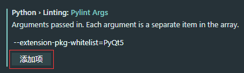

# github仓库地址
https://github.com/yuerain1990/PyQt5

# 问题记录

### 问题1 No name 'QWidget' in module 'PyQt5.QtWidgets'

- 解决方法1：
在VS 中使用pylint，编辑pyqt5文件时出现了很多代码错误提示，通过网上查找资料得到下面解决方法：
原因：新版pylint默认不支持外部扩展模块,pyqt5是C++写的外部扩展，因此在【用户设置】那里添加下面设置即可：

```json
"python.linting.pylintArgs": [
	"--extension-pkg-whitelist=PyQt5"
]
```



- 解决方法2：
在项目主目录下新建一个.pylintrc文件，然后在这个文件里添加一行

```json
extension-pkg-whitelist=PyQt5
```
